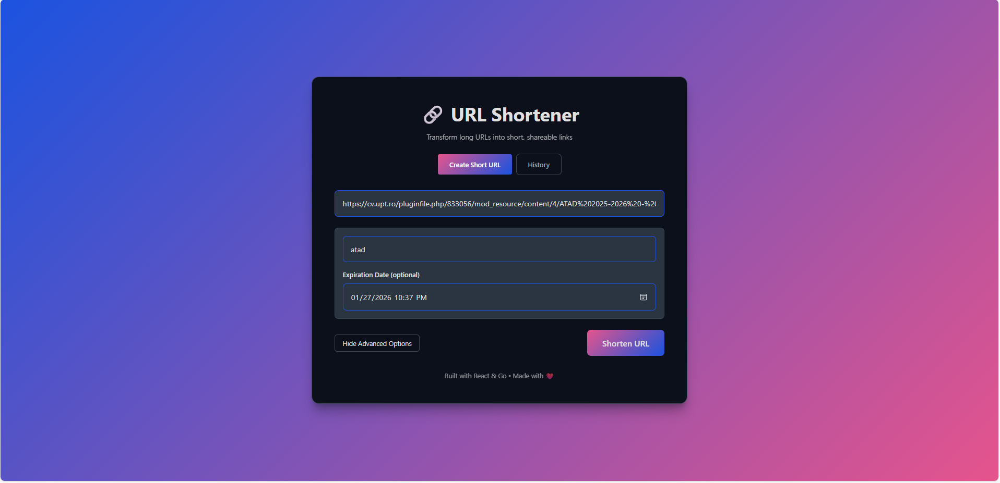
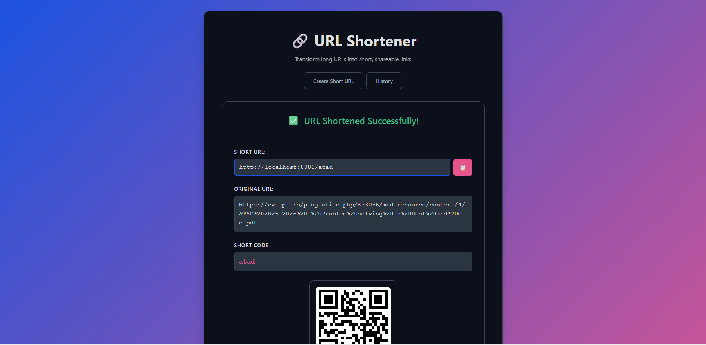

# Screenshots & Examples

Documentation assets for the URL Shortener project.

---

## API Response Examples

### 1. Create Short URL

**Request:**

```bash
POST /api/shorten
Content-Type: application/json

{
  "url": "https://github.com/example/repository",
  "custom_code": "mycode",        # optional
  "expires_at": "2026-02-01T00:00:00Z"  # optional, RFC3339 format
}
```

**Response (201 Created):**

```json
{
    "short_url": "http://localhost:8080/3gnR0R",
    "original_url": "https://github.com/example/repository",
    "code": "3gnR0R"
}
```

**Error Response (409 Conflict):**

```json
{
    "error": "short code already exists"
}
```

---

### 2. Get URL Details

**Request:**

```bash
GET /api/urls/{shortCode}
```

**Response (200 OK):**

```json
{
    "id": 1,
    "short_code": "3gnR0R",
    "original_url": "https://github.com/example/repository",
    "created_at": "2026-01-27T22:30:00Z",
    "expires_at": null,
    "click_count": 5,
    "last_clicked": "2026-01-27T23:15:00Z"
}
```

**Error Response (404 Not Found):**

```
URL not found
```

---

### 3. Get All URLs

**Request:**

```bash
GET /api/urls
```

**Response (200 OK):**

```json
[
    {
        "id": 1,
        "short_code": "3gnR0R",
        "original_url": "https://github.com/example/repository",
        "created_at": "2026-01-27T22:30:00Z",
        "expires_at": null,
        "click_count": 5,
        "last_clicked": "2026-01-27T23:15:00Z"
    },
    {
        "id": 2,
        "short_code": "abc123",
        "original_url": "https://example.com/page",
        "created_at": "2026-01-27T20:00:00Z",
        "expires_at": "2026-02-01T00:00:00Z",
        "click_count": 12,
        "last_clicked": "2026-01-27T22:00:00Z"
    }
]
```

---

### 4. Get URL History (with status)

**Request:**

```bash
GET /api/history
```

**Response (200 OK):**

```json
[
    {
        "id": 1,
        "short_code": "3gnR0R",
        "original_url": "https://github.com/example/repository",
        "created_at": "2026-01-27T22:30:00Z",
        "expires_at": null,
        "click_count": 5,
        "last_clicked": "2026-01-27T23:15:00Z",
        "status": "active"
    },
    {
        "id": 2,
        "short_code": "oldcode",
        "original_url": "https://expired-link.com",
        "created_at": "2026-01-01T00:00:00Z",
        "expires_at": "2026-01-15T00:00:00Z",
        "click_count": 3,
        "last_clicked": "2026-01-10T12:00:00Z",
        "status": "expired"
    }
]
```

---

### 5. Delete URL

**Request:**

```bash
DELETE /api/urls/{shortCode}
```

**Response (204 No Content):**

```
(empty body)
```

**Error Response (404 Not Found):**

```
URL not found
```

---

### 6. Redirect

**Request:**

```bash
GET /{shortCode}
```

**Response (301/302 Redirect):**

```
Location: https://github.com/example/repository
```

---

### 7. Get Analytics

**Request:**

```bash
GET /api/analytics/{shortCode}
```

**Response (200 OK):**

```json
{
    "url": {
        "id": 1,
        "short_code": "3gnR0R",
        "original_url": "https://github.com/example/repository",
        "created_at": "2026-01-27T22:30:00Z",
        "expires_at": null,
        "click_count": 5,
        "last_clicked": "2026-01-27T23:15:00Z"
    },
    "click_events": [
        {
            "id": 1,
            "url_id": 1,
            "ip_address": "192.168.1.100",
            "user_agent": "Mozilla/5.0 (Windows NT 10.0; Win64; x64)",
            "referer": "https://google.com",
            "created_at": "2026-01-27T23:00:00Z"
        }
    ],
    "summary": {
        "total_clicks": 5,
        "unique_ips": 3,
        "top_referers": {
            "https://google.com": 2,
            "https://twitter.com": 1,
            "direct": 2
        },
        "top_user_agents": {
            "Mozilla/5.0 (Windows)": 3,
            "Mozilla/5.0 (iPhone)": 2
        },
        "clicks_by_hour": {
            "2026-01-27T22:00:00Z": 2,
            "2026-01-27T23:00:00Z": 3
        }
    }
}
```

---

## Database Schema Diagram

```
┌─────────────────────────────────────┐
│              urls                   │
├─────────────────────────────────────┤
│ id           SERIAL PRIMARY KEY     │
│ short_code   VARCHAR(10) UNIQUE     │
│ original_url TEXT NOT NULL          │
│ created_at   TIMESTAMP              │
│ expires_at   TIMESTAMP              │
│ click_count  INTEGER DEFAULT 0      │
│ last_clicked TIMESTAMP              │
└─────────────────────────────────────┘
              │
              │ 1:N
              ▼
┌─────────────────────────────────────┐
│          click_events               │
├─────────────────────────────────────┤
│ id           SERIAL PRIMARY KEY     │
│ url_id       INTEGER REFERENCES urls│
│ ip_address   VARCHAR(45)            │
│ user_agent   TEXT                   │
│ referer      TEXT                   │
│ created_at   TIMESTAMP              │
└─────────────────────────────────────┘
```

---

## Architecture Diagrams

See [architecture.md](../architecture.md) for detailed system architecture diagrams.

---

## Screenshots

Main URL shortener form




URL shortener view




URL history list


